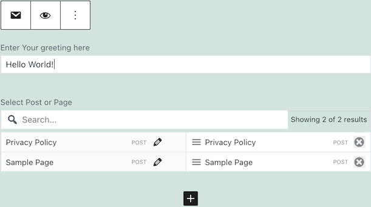
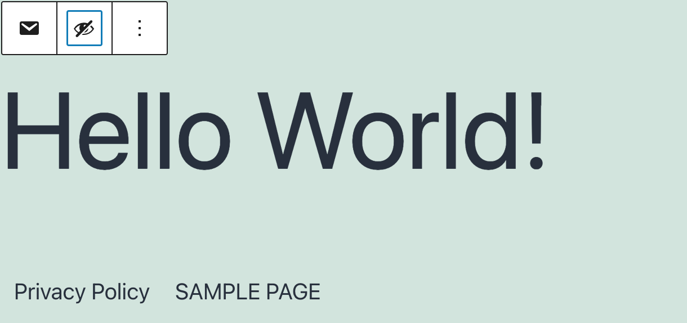

[](https://github.com/ergosarapu/wp-htmlblocks/actions)
[](LICENSE)
# WP HtmlBlocks plugin

Capture sections of HTML document into Wordpress Blocks so that HTML template can be filled with Wordpress content. Well-suited for composing HTML template based newsletters quickly and regularly.

# Install using Composer

Add repository into composer.json (this is required until the package gets distributed throgh packagist):

```json
"repositories": [
    ...
    {
      "name": "ergosarapu/wp-htmlblocks",
      "type": "vcs",
      "url": "git@bitbucket.org:ergosarapu/wp-htmlblocks.git"
    }
  ]
```

The plugin uses [Carbon Fields](https://github.com/htmlburger/carbon-fields) composer dependency. Carbon Fields library contains JS/CSS assets, which are requested by wp-admin but not found due to the default vendor directory not being a web directory.

A workaround is to install Carbon Fields library to web directory by changing installer-paths for "htmlburger/carbon-fields":

```json
"extra": {
    "installer-paths": {
        "YOUR_DESIRED_LOCATION/vendor/{$vendor}/{$name}/": ["htmlburger/carbon-fields"]
    }
}
```

Require WP HtmlBlocks plugin using Composer:

```bash
composer require "ergosarapu/wp-htmlblocks"
```

# Configuration

Configuration is currently loaded when environment variable `HTMLBLOCKS_CONFIG` is set to a valid YAML configuration file.

Example HTML:
```html
<html>
    <h1>Greeting</h1>
    <table>
        <tr>
            <td id="post_left">Post on left</td>
            <td id="post_right">Post on right</td>
        </tr>
    </table>
</html>
```
Example YAML configuration:
```yaml
block: # Define block
  name: Newsletter # Block name
  description: Newsletter block # Block description
  xpath: //html # Select whole HTML to render this Block
  icon: email # Block icon as WP Dashicon
  category: # Set category this Block appears under
    slug: newsletter
    title: Newsletter
    icon: email
  fields: # Create Fields for Block
    - field:
        type: text # Field type 'text' (can be any of Carbon Fields supported field types)
        name: greeting
        label: Enter Your greeting here
        replaces: # Define how Field values replaces sections in HTML 
          - replace:
              xpath: //h1/text() # XPath of section to replace in HTML
              value_path: greeting # Path to field value using dot notation
  blocks: # Define unlimited nested blocks
    - block:
        name: Two Posts
        description: Two Posts block
        xpath: //tr
        icon: block-default
        category:
          slug: newsletter
          title: Newsletter
          icon: email
        fields:
          - field:
              type: association
              name: posts
              label: Select Post or Page
              functions: # Configure Field using config methods supported by Carbon Fields
                - name: set_types
                  args:
                    - - type: post
                        post_type: post
                      - type: post
                        post_type: page
                - name: set_min
                  args:
                    - 2
                - name: set_max
                  args:
                    - 2
              replaces:
                - replace:
                    xpath: //td[@id="post_left"]/text()
                    function:
                      name: get_the_title
                      args:
                        - arg:
                            value_path: posts.0.id
                - replace:
                    xpath: //td[@id="post_right"]/text()
                    function: # Call arbitrary functions to render desired replacement result
                      name: strtoupper
                      args:
                        - arg:
                            function: # Pass another arbitrary function as an argument
                              name: get_the_title
                              args:
                                - arg:
                                    value_path: posts.1.id
```
Example blocks in WP admin:



Example rendered result:


# Tasks

- `composer build` - build by running tests and code checks
- `composer test` - run tests
- `composer phpcs` - run PHP CodeSniffer
- `composer phpmd` - run PHP Mess Detector

# License

Licensed under GPLv2